# PINNs-MPF — a Physics-Informed Neural Network for Multi-Phase-Field Problems

PINNs-MPF solves multi-phase-field microstructure evolution with physics-informed
neural networks, using a decomposition in **space and time** to keep large, stiff
problems tractable. It accompanies the published study *Elfetni & Darvishi Kamachali,
Engineering Analysis with Boundary Elements 176 (2025) 106200* ([article](Article--PINNs-MPF.pdf)).

This release is an upgrade of the published PINNs-MPF code. The physics and the
space–time decomposition strategy are unchanged; the implementation is consolidated,
runs natively on GPU in double precision, and each spatial worker now emits all phase
fractions through a single **softmax** output — for the four-phase triple junction, one
worker network per subdomain outputs four phase logits mapped to `Σφ=1` by construction,
in place of a per-phase network stack. Every benchmark below is re-validated at high
precision against an analytic or finite-difference phase-field reference.

## How PINNs-MPF Works

PINNs-MPF solves multi-phase-field evolution by decomposing it in **space and time**. The periodic 2D domain is partitioned into a grid of overlapping spatial subdomains — one **worker network** per subdomain — and the evolution is marched through successive **time windows**. Within each window the workers train together under a physics-informed loss; **internal continuity** and **periodic-seam** conditions stitch the subdomains into a single field, a **softmax** output enforces the phase-sum constraint by construction, and autonomous marches can hand each converged field off as the initial condition for the next.

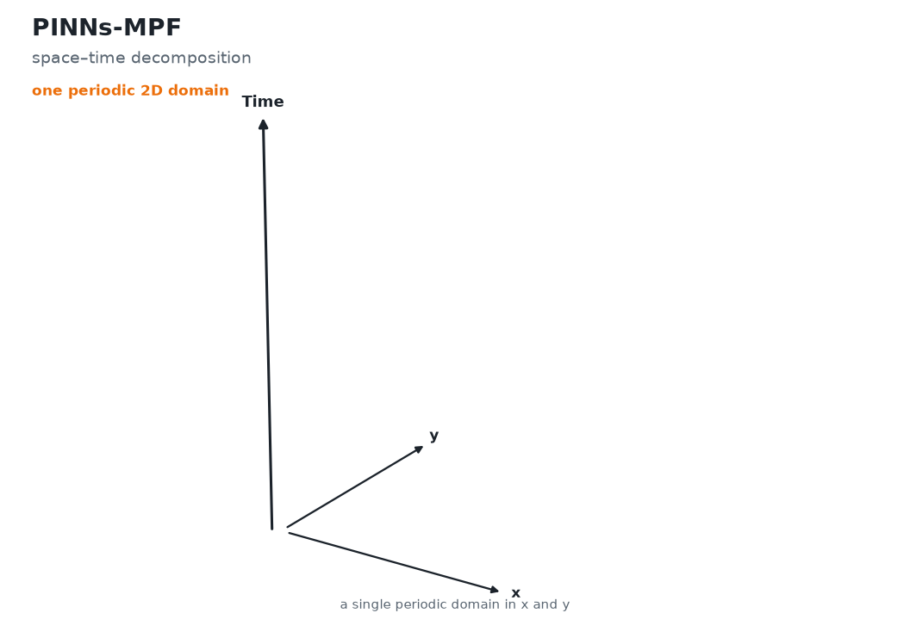

*Space–time decomposition (schematic). The 2×2 split shown is the simplest case — the same code runs any `N×N` decomposition (4×4, 6×6, …), chosen to match the problem's complexity.*

## Implemented Method

Each time window is solved with a **softmax MultiNN** workflow in five stages: **(1)** set up the window from its start field, **(2)** sample PDE / initial-condition / internal-continuity / periodic-seam / bulk-stabilization points — concentrated along the interfaces, **(3)** evaluate one spatial **worker network per subdomain**, each emitting four logits, **(4)** map the logits through a **softmax** so the phase fractions sum to one by construction, then evaluate the physics-informed loss, and **(5)** stitch the full-domain field and validate it against the finite-difference reference.

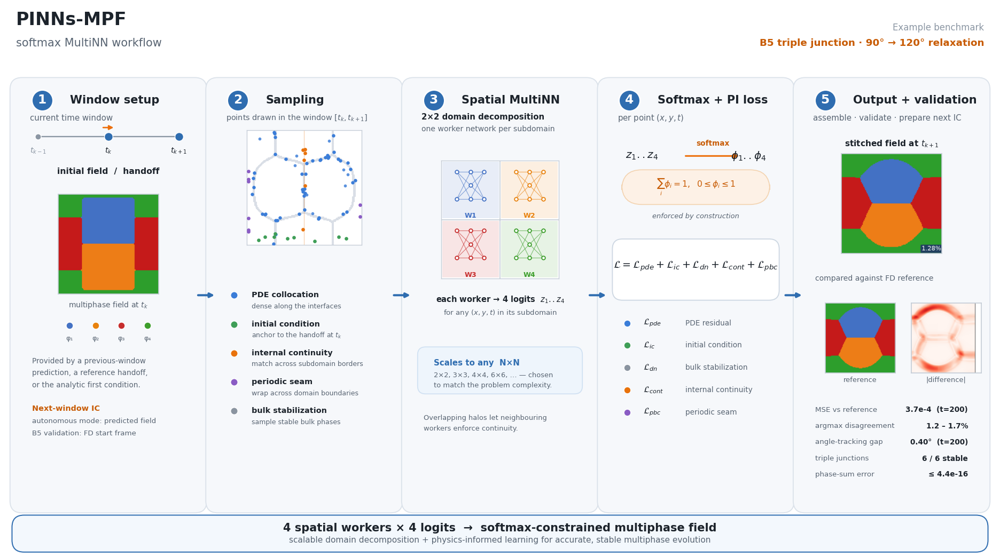

*Implemented workflow, illustrated on the **B5 triple-junction benchmark** — a 90° → 120° relaxation (4 phases, 2×2 decomposition, 8 time windows). The microstructure panels are the benchmark's own finite-difference reference, PINNs-MPF prediction, and absolute-difference fields; the metrics shown are the run's actual values. For this validated B5 run, each window starts from the corresponding finite-difference reference frame; reference endpoints are used for evaluation, not as in-window training labels.*

## Why the Method Decomposes: the Single-Network Limit (B2) ?

The space–time decomposition is not incidental — it is what makes these problems
solvable. Under a bulk driving force, a single global network cannot hold a sharp
diffuse interface: on one driven-force time window the grain amplitude collapses
(peak `φ` falls to `0.55`, a low-contrast blob). Splitting the same domain into a
`2×2` grid of four worker networks — each seeing a small, locally near-flat piece of
the interface — restores the sharp interface (peak `φ = 0.95`) on the identical window.
This is the motivation for the multi-network, time-marched design validated throughout
the rest of this page.

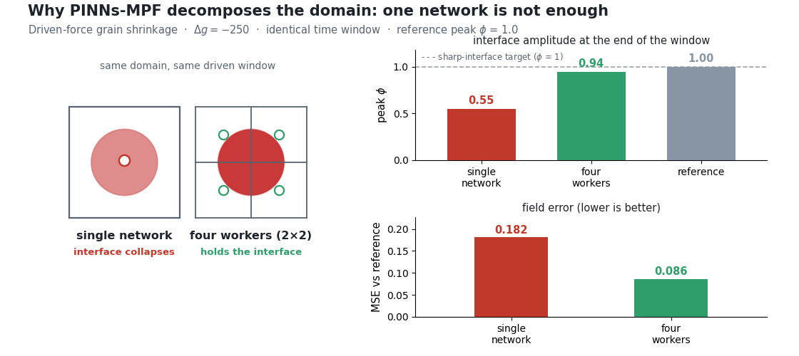

*One network vs four workers on the identical driven-force window (`Δg=−250`). This is a **motivating baseline, not a validated result** — see [B2 — single-network baseline](validated_benchmarks/B2_single_network_driving_force/) for the full demonstration. The validated driven-force result is [B3](#b3-driven-force-grain-shrinkage) below.*

## Validation Status

| Benchmark | Purpose | Current Result |
|---|---|---|
| B1 traveling wave | analytic moving-interface baseline | MSE `2.68e-7`, interface velocity error `0.04%` |
| B2 single-network limit | motivation: why one network is not enough | single network collapses the driven interface (peak `φ` `0.55`) vs `0.95` for the `2×2` decomposition — a motivating baseline ([details](validated_benchmarks/B2_single_network_driving_force/)) |
| B3 driven-force grain shrinkage | time-marched shrinkage under a bulk driving force | `128 x 128`, radius tracked from `R=38` to `R≈13`; median error `1.26%` vs the finite-difference reference (`0.59%` vs analytic theory) through the validation target; near-extinction over-shrink is a known limit |
| B4 curvature-driven grain shrinkage | time-marched curvature-driven shrinkage (`Δg=0`) | radius tracked from `R=25` to `R=8.49`; final small-radius interval max relative error `2.59%` |
| B5 triple junction | multiphase junction relaxation on a larger grid | `128 x 128`, six junctions maintained through `t=200`; final MSE `3.70e-4`, argmax disagreement `1.36%`, angle gap `0.40 deg` |

## Visual Validation Gallery

### B5 Triple Junction

The main multiphase validation starts from a four-phase, six-junction configuration with local `90/90/180` angles. The phase-field reference relaxes rapidly toward a near-Young-angle network. PINNs-MPF is trained in time windows and compared against the phase-field reference over the full trajectory. In this validation protocol, each window starts from the corresponding phase-field reference frame rather than from a fully autonomous rollout; within the window, the reference endpoint is held back for evaluation.

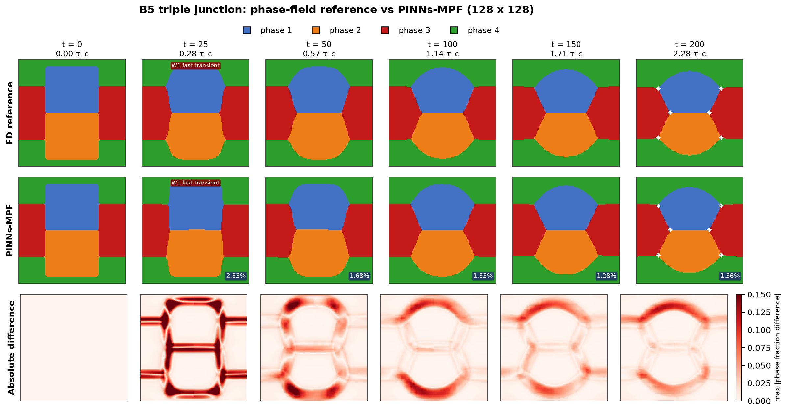

The three rows show the phase-field reference, the PINNs-MPF prediction, and the maximum absolute phase-fraction difference. The first interval is the hardest part of the problem: the reference rounds the initial right-angle geometry very quickly, while PINNs-MPF still carries part of the rectangular initial shape at `t=25`. From `t=50` onward, the two fields are visually close, and the remaining difference stays concentrated in the diffuse-interface band.

The physics being reproduced is a continuous relaxation: the microstructure evolves from the `90`-degree initial condition toward the `120`-degree Young-angle network while the junction angles converge to `120` degrees and the interfacial energy dissipates.

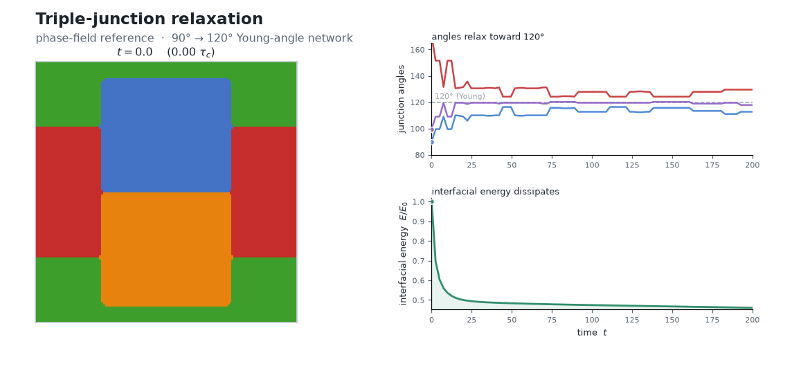

Under this single relaxation, the domain is actually solved by **four worker networks** on a `2×2` spatial decomposition. The animation below makes that structure visible: the field evolves as one continuous whole, the four subdomains slide apart to reveal the individual workers coordinated by a master network, then reassemble with the grain boundaries reconnecting unbroken across the seams — the internal-continuity and periodic-seam conditions stitching the four networks into one field.

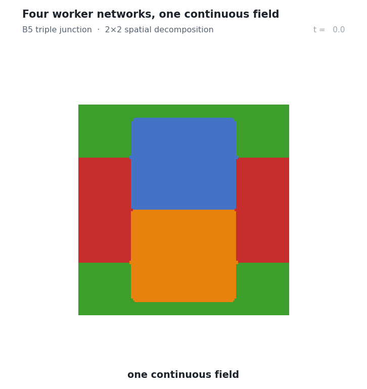

At `t=200` (`2.28 tau_c`), PINNs-MPF reaches:

| Quantity | Value |
|---|---:|
| MSE vs phase-field reference | `3.70e-4` |
| Argmax disagreement | `1.36%` |
| Angle-tracking gap | `0.40 deg` |
| Junction count | `6` |
| Max phase-sum error | `3.33e-16` |

The claim is therefore topology and field tracking under the time-window PINNs-MPF protocol. The first rapid relaxation interval remains a disclosed limitation; later intervals satisfy the field, topology, seam, and angle-tracking checks.

Underneath the field match is the physics being reproduced: the junction angles relax from `90/90/180` toward the `120` degree Young equilibrium while the interfacial free energy dissipates to `0.46` of its initial value.

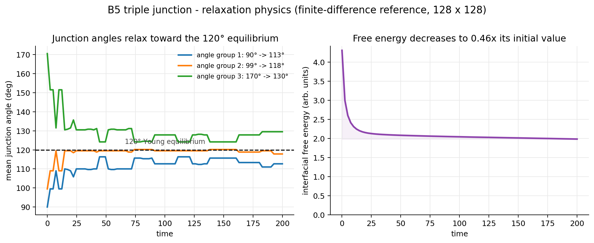

#### Smaller-Grid Reference

The `64 x 64` version is retained as a smaller-grid comparison from the same benchmark family. It uses a different, near-equilibrium initial condition (the junction angles start close to `120` degrees), so it is not a pure grid-refinement control of the `128 x 128` 90-degree relaxation.

The finite-difference reference evolves subtly from this near-equilibrium start while the interfacial energy dissipates:

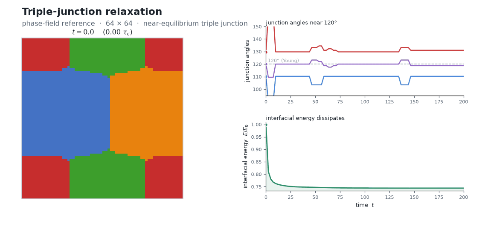

PINNs-MPF is compared against this reference over the full trajectory:

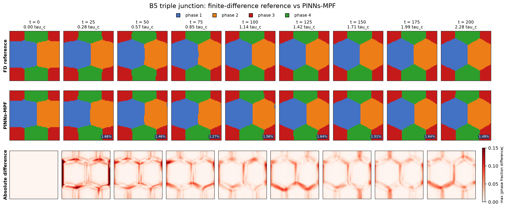

### B3 Driven-Force Grain Shrinkage

The B3 benchmark validates grain shrinkage under a bulk driving force on a `128 x 128` domain. A circular grain of radius `R=38` cells shrinks under combined curvature and a driving force `Δg=−0.5`. PINNs-MPF marches the radius over 40 time intervals and is compared against the finite-difference phase-field reference. This is the validated `3×3` non-uniform-worker, time-marched result for the driven physics that a single network cannot solve ([B2](#why-the-method-decomposes-the-single-network-limit-b2)). The animation of the shrinking grain is shown once below, in the [march-to-extinction](#extended-march-to-extinction-demonstration) subsection — it follows this same grain from `R=38` and simply continues past the validation window.

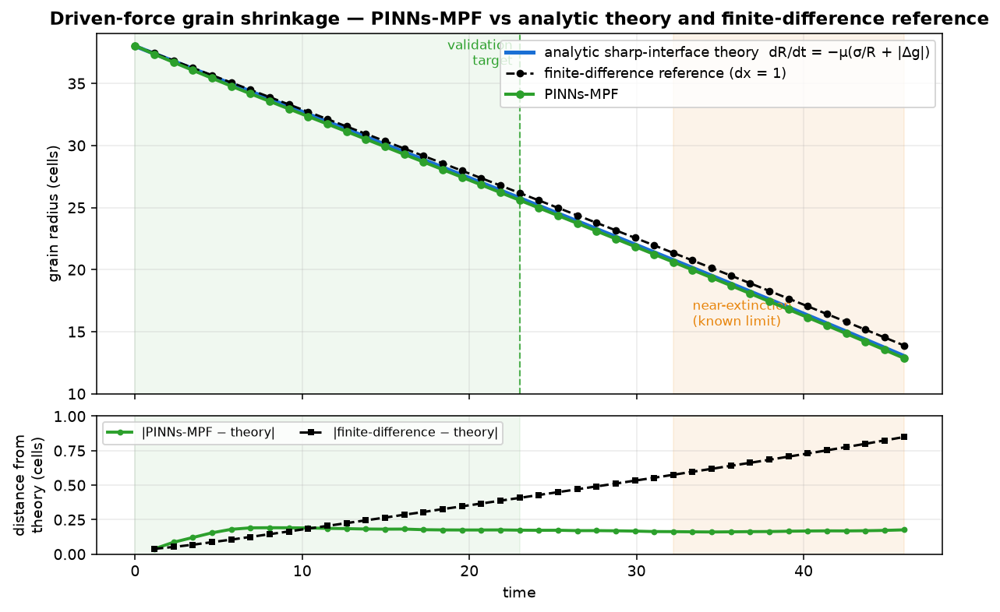

The radius follows the driven sharp-interface law `dR/dt = −μ(σ/R + |Δg|)`, which is faster and closer to linear than the curvature-only parabola. Through the validation target (interval 20, `t≈23`) the radius error vs the finite-difference reference stays small — median `1.26%`, maximum `2.22%` — and the predicted shrinkage rate matches the reference to within `4%`. The interface stays sharp and circular throughout. A small over-shrink accumulates near extinction and crosses the absolute tolerance in the final intervals, ending at a `1.025`-cell gap; this near-extinction over-shrink is a reported limitation, not a loss of stability.

The figure shows three curves with distinct roles — the **analytic sharp-interface theory** (prominent blue), the **finite-difference reference** (`dx=1`, black dashed), and **PINNs-MPF** (green). Reported both ways over the validated region, PINNs-MPF sits within `0.59%` (median) of the analytic law while the finite-difference reference — carrying its own `dx=1` discretization error — sits `0.68%` from it; much of the headline "over-shrink vs the finite-difference reference" is that reference's own drift away from the theory. This is not a claim of PINNs-MPF being more accurate than the finite-difference solver (the sharp-interface law is itself an idealization); both references are kept, with distinct roles ([dual-gap details](validated_benchmarks/B3_driven_force/#radius-accuracy-against-theory-and-against-the-finite-difference-reference-dual-gap)).

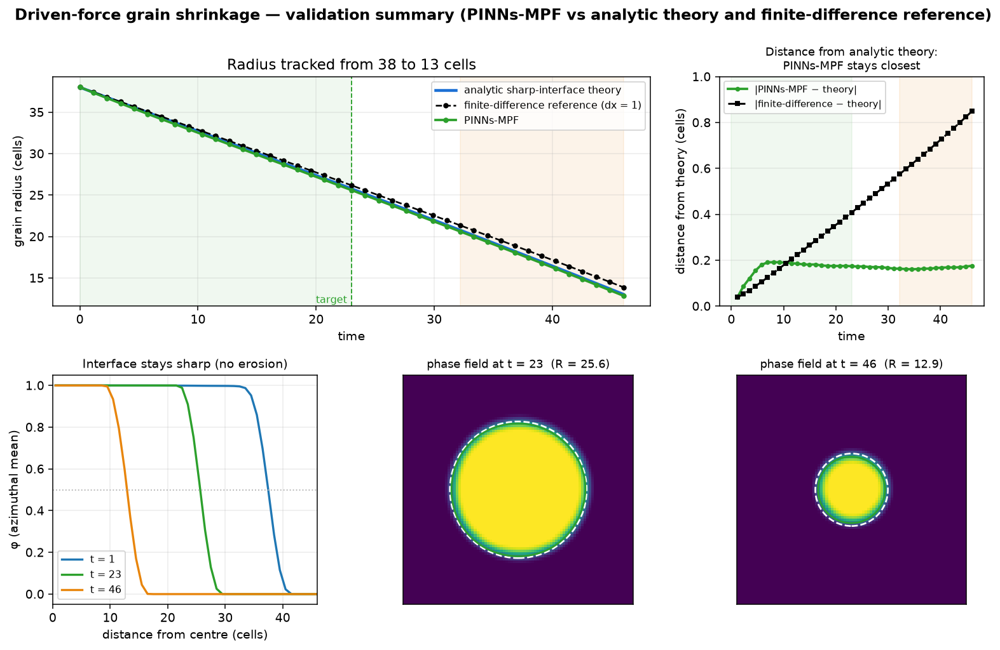

#### Extended march to extinction (demonstration)

A separate demonstration follows the *same* grain all the way to `R → 0` over 58 intervals — a complete, convincing closure. It is a demonstration, **not** part of the validated claim: following the grain to zero necessarily enters the sub-η regime (radius below the `η=7`-cell interface width), where the diffuse interface can no longer resolve the grain and the field amplitude fades. That limit is shown openly.

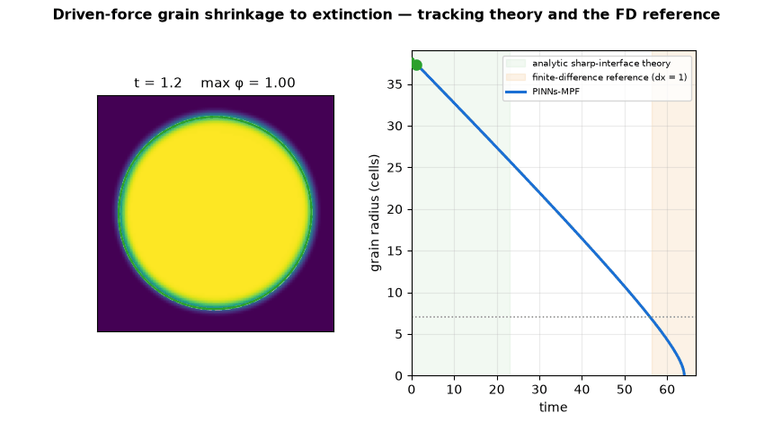

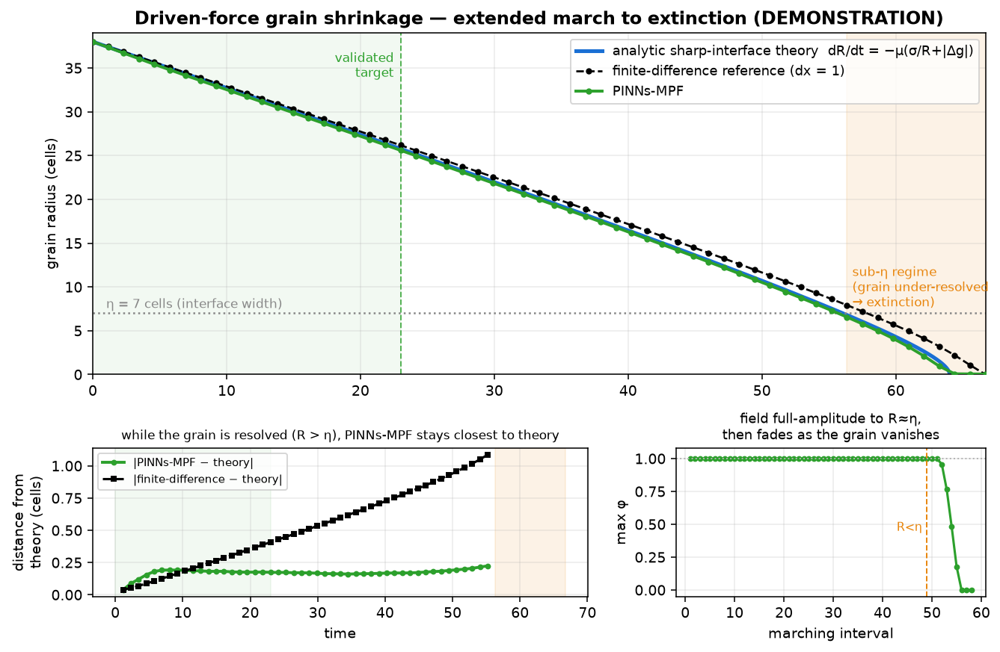

While the grain is resolved (`R > η`) PINNs-MPF stays within about `0.17` cell of the analytic sharp-interface law, while the finite-difference reference drifts past `1` cell from it. Below `R ≈ η` PINNs-MPF slightly under-shrinks and the field amplitude fades to zero as the grain becomes unresolvable — the expected diffuse-interface limit, shown rather than hidden. Full figures and the honest-scope discussion are in **[`demo_extinction/`](validated_benchmarks/B3_driven_force/demo_extinction/)**.

### B4 Curvature-Driven Grain Shrinkage

The B4 benchmark validates curvature-driven shrinkage on a `64 x 64` domain. The phase-field reference provides the evolving field and radius; PINNs-MPF tracks the grain radius through early, middle, and late shrinkage intervals.

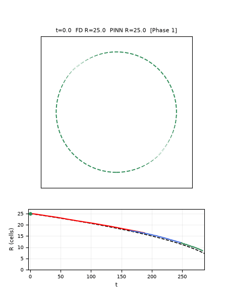

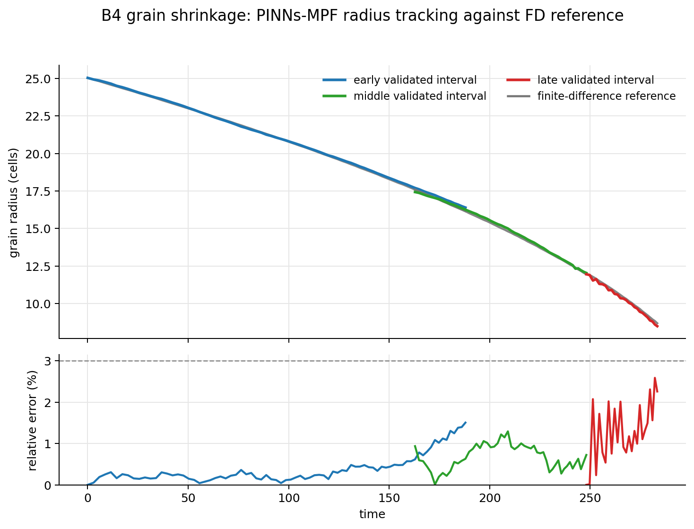

The squared radius follows the analytic parabolic law `R^2 = R0^2 - 2 mu sigma t`, and the relative radius error stays tightly bounded across the accepted steps (median `0.48%`, 95% below `1.74%`).

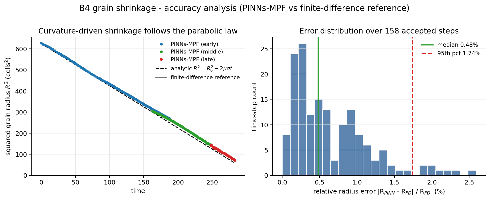

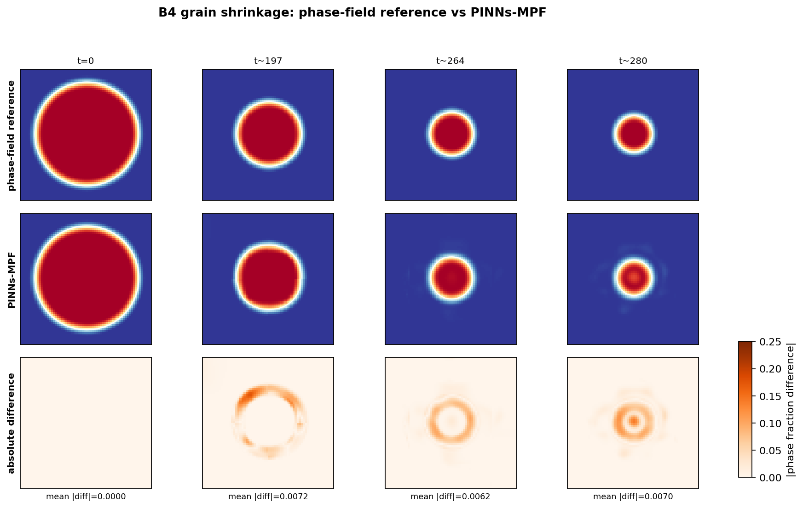

### B1 Traveling Wave

B1 is the analytic baseline for PINNs-MPF. It confirms that the implementation reproduces a one-dimensional moving interface with high precision.

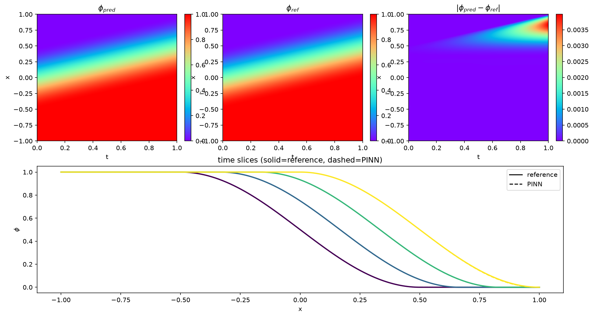

## Method and Physics Summary

Each time window minimizes a physics-informed loss (shown for the multiphase B5 case):

```text
L = w_pde L_pde
  + w_ic L_ic
  + w_dn L_denoising
  + w_cont L_internal_continuity
  + w_pbc L_periodic_seam
```

The phase-sum constraint is enforced by a softmax output layer. The phase-field frame at the start of each window is used as that window's initial condition. Endpoint phase-field data are used for evaluation and figures, not as supervised endpoint targets in the PINNs-MPF loss.

For the complete governing physics, the per-term loss formulation, and the specific numerical considerations of each benchmark, see the **[Technical Report](TECHNICAL_REPORT.md)**.

## Explorations benchmarks

Beyond the validated set (B1–B5), the [`explorations/`](explorations/) directory holds
**exploratory framework studies**. These map the edge of the current framework and the options for
pushing it, and may report neutral or negative results — **they are not validation claims** and are
deliberately kept out of `validated_benchmarks/`.

### B6 — Scaling to a multi-grain microstructure (capability envelope & method options)

A 16-grain / 6-phase "brick-wall" microstructure on a `256 × 256` grid (~32 triple junctions) —
far larger than the B5 triple junction. It maps two things honestly.

**(1) Capability envelope.** At this scale PINNs-MPF trains stably and produces physically valid
fields (`Σφ=1`, bounded interfaces) and tracks the large-scale topology — the marched endpoint
disagrees with the finite-difference reference on `4.0%` of cells, closer than the unevolved initial
condition (`7.1%`) over the horizon — using **finite-difference handoff each window** and
**reference-based checkpoint selection** for display, so it characterises the framework's reach at
scale rather than a field-accuracy validation.

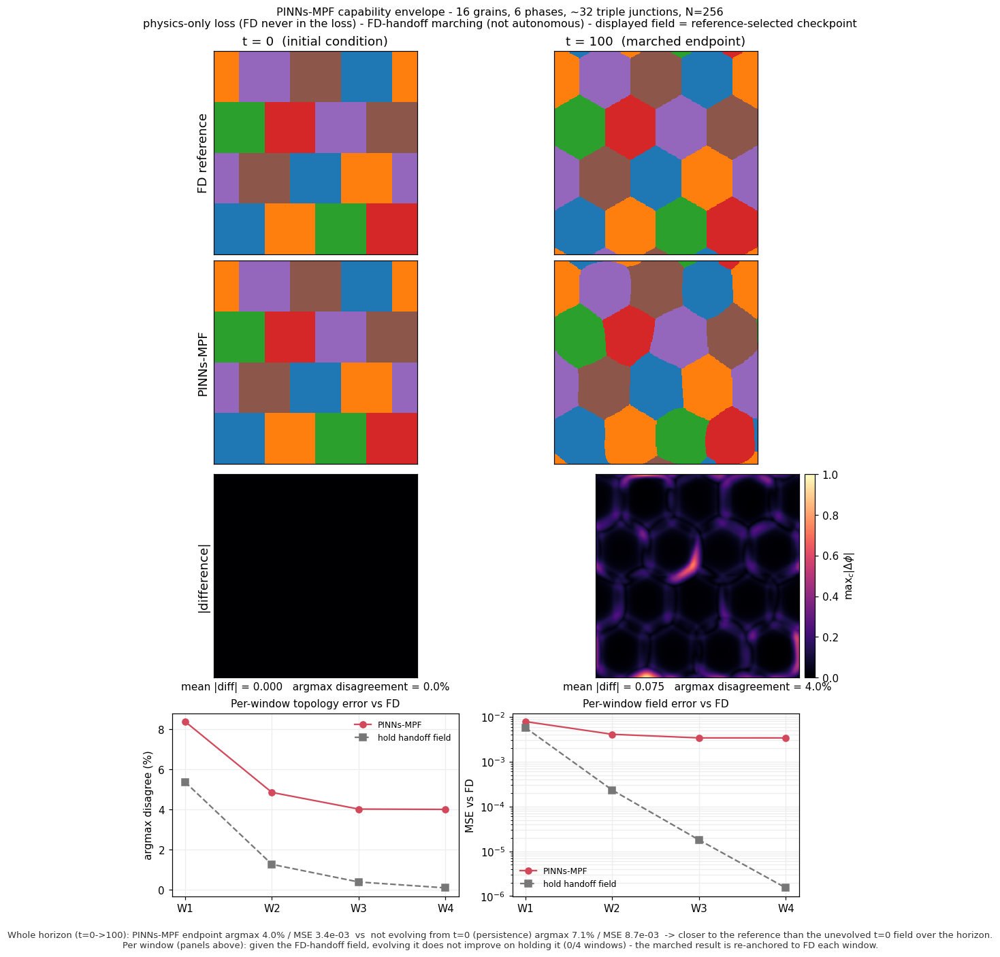

*Scaling to a 16-grain microstructure. Top rows: reference, PINNs-MPF, and `|difference|` at `t=0`
and the marched endpoint `t=100`. Over the whole horizon the prediction is closer to the reference
than the unevolved `t=0` field (`4.0%` vs `7.1%` argmax); per window, given the finite-difference
handoff field, evolving it does not improve on holding it. Both the reference handoff and the
reference-based checkpoint selection are marked on the figure — this is a capability envelope, not a
field-accuracy validation.*

**(2) Method option.** An optional **pyramidal initialization** mechanism (interface-rich fine-box
selection → bit-exact transfer → seam repair), which matches the flat baseline on this configuration
and is an open direction for regimes where training convergence is the bottleneck. The concept figure
below shows how the decomposition is laid out on this problem — the geometry only, with no performance
numbers.

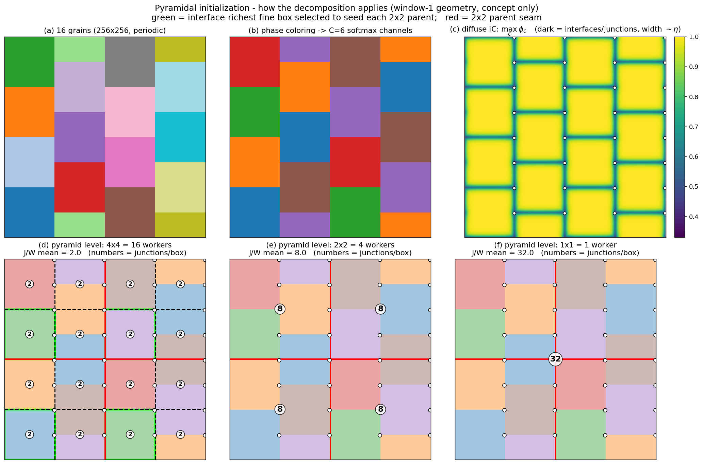

*How the pyramidal decomposition applies (window-1 geometry, concept only). The 16-grain
microstructure maps to `C=6` softmax channels and a diffuse initial field; the three pyramid levels
(`4×4 → 2×2 → 1×1` workers) show the triple junctions, the junctions-per-worker load (`J/W` rising as
workers coarsen), the `2×2` parent seam (red), and the interface-richest fine box selected to seed
each parent quadrant (green).*

Self-contained, CPU-only figures. See
[`explorations/multi_grain_scaling/`](explorations/multi_grain_scaling/).

## Original Code and Citation

The original code accompanying the published article is preserved in
[`legacy_version/`](legacy_version/) for lineage and reference — **code only** (figures, saved
weights, and generated data removed for size), alongside the authors' own original notes. It is
the starting point that the current package consolidates, makes GPU-native, and re-validates.

If you use this work, please cite the article (see [`CITATION.cff`](CITATION.cff)):

> Elfetni & Darvishi Kamachali, *PINNs-MPF: A Physics-Informed Neural Network framework for
> Multi-Phase-Field simulation of interface dynamics*, Engineering Analysis with Boundary
> Elements **176** (2025) 106200. [DOI](https://doi.org/10.1016/j.enganabound.2025.106200)

## Repository Layout

Two benchmark directories with complementary roles: **`benchmarks/`** holds the runnable
scripts (the code that produces the results), and **`validated_benchmarks/`** holds the
curated evidence those scripts generate (figures, metrics, per-benchmark notes).

```text
PINNs-MPF/
  pinns_mpf/                 PINNs-MPF source code (the library)
  benchmarks/                runnable scripts — PRODUCE the evidence
    b1_traveling_wave/       B1 runner
    b2_grain_shrinkage/      grain-shrinkage runner (drives the B3 and B4 results)
    b5_triple_junction/      B5 multi-network runner
  reference/                 analytic and phase-field reference solvers
  tests/                     regression and smoke tests
  validated_benchmarks/      curated evidence — PRODUCED by benchmarks/
    B1_traveling_wave/       analytic traveling-interface evidence
    B2_single_network_driving_force/  single-network limit (why decomposition is needed)
    B3_driven_force/         driven-force grain-shrinkage evidence and figures
    B4_grain_shrinkage/      curvature-driven grain-shrinkage evidence and figures
    B5_triple_junction/      128 x 128 triple-junction evidence through t=200
  explorations/              exploratory framework studies (NOT validated benchmarks)
    multi_grain_scaling/     B6 scaling study: capability envelope + pyramidal-init option
  provenance/                generated manifest and file inventory
  legacy_version/            original published code (code-only, for lineage/reference)
  TECHNICAL_REPORT.md        full physics, losses, and per-benchmark details
  CITATION.cff               how to cite the article
```

## Reproduce Or Inspect

Lightweight local checks:

```bash
pytest tests/test_b1_regression.py
pytest tests/test_pf_solver.py tests/test_pf_solver_multiphase.py
pytest tests/test_b5_smoke.py
```

Inspect or reproduce the validated driven-force benchmark (B3). The runner's default option `B3_DRIVEN_FORCE` **is** the validated configuration (`Δg = −0.5`, `R₀ = 38`, `128 × 128`, `3 × 3` non-uniform workers, per-window convergence gate to `loss < 2e-6`, `K = 40` windows to `t = 46`):

```bash
# print the exact resolved config — CPU only, no training:
python benchmarks/b3_driven_force/run.py --print-config
# reproduce the run — GPU recommended, float64 is the default:
python benchmarks/b3_driven_force/run.py --outdir outputs/b3_driven_force
```

GPU runs should be launched only after review of the intended configuration, reference data, expected wall time, and output location.

## Next Scientific Step

The single- and multi-phase benchmark set B1–B5 is covered: B1 fixes the analytic baseline,
B2 motivates the decomposition, and B3/B4/B5 validate the multi-network, time-marched results
against analytic or finite-difference phase-field references.

The pyramidal-training study (**B6**) from the original article is included as an **exploratory
scaling study** ([Explorations](#explorations-not-validated-benchmarks)) rather than a validated
benchmark: it maps the framework's behaviour on a much larger 16-grain / 6-phase microstructure and
demonstrates the pyramidal-initialization mechanism, without making a validation claim.

## Successor Model
PINN-Phase_V2 

PINN-Phase: Physics-informed neural time integrators for curvature-driven phase-field evolution.
The model  advances an initial phase field one admissible neural step at a time, capturing growth, shrinkage, extinction, and topology change in two- and three-dimensional designed benchmarks.
**[PINN-Phase repository](https://github.com/SFETNI/PINN-Phase.git)**

## License

This package is released under the **MIT License** (SPDX identifier: `MIT`), a permissive
open-source license. The full text is in [`LICENSE.txt`](LICENSE.txt).

The original published code preserved in [`legacy_version/`](legacy_version/) is included for
lineage and reference — see [Original Code and Citation](#original-code-and-citation).
