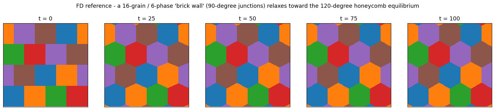
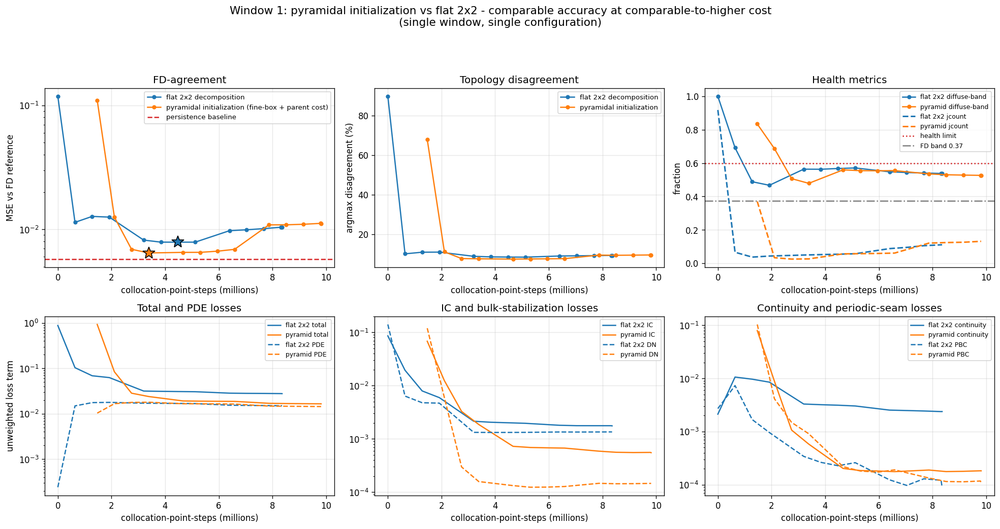

# Scaling study: multi-grain microstructure (capability envelope & method options)

This is a **scaling study**. It examines how PINNs-MPF behaves on a microstructure substantially
larger and more complex than the validated benchmarks (B1–B5), and it demonstrates an optional
pyramidal-initialization technique. It characterises the framework's reach and its available
options at scale; it is distinct from the validation benchmarks, and the **Scope** note in each
section explains how to read its accuracy figures.

## Benchmark setup

A periodic **16-grain, 6-phase** microstructure ("brick wall" of grains, every T-junction
starting at 90 degrees) on a 256×256 grid. Being far from the 120-degree Young equilibrium, the
structure relaxes toward a honeycomb pattern, generating a real, well-posed evolution. This is well
beyond the 4-grain / 6-junction triple-junction case (B5) and exercises the framework at a larger
grain count, phase count (6), and junction density (~32 triple junctions).

| property | value |
|---|---|
| grid | 256 × 256 |
| grains / phases | 16 grains / 6 phases |
| triple junctions | ≈ 32 |
| protocol | marched, 4 windows (t = 0 → 100), finite-difference reference handoff at each window |
| decomposition | 2×2 workers (softmax multi-network, Σφ = 1 by construction) |
| training | **physics-only** — PDE + IC + bulk stabilization + continuity + periodic-seam. The finite-difference reference field is **never** part of the training loss. |

## 1. Capability envelope — the framework at N=256


At this scale PINNs-MPF trains stably and produces physically valid fields — the phase fractions
sum to one by construction and the interfaces stay bounded — evolving the 90-degree brick wall into
the honeycomb topology. Its agreement with the finite-difference reference has two aspects, both
shown in the figure:

- **Over the full horizon**, the marched prediction is closer to the reference than the unevolved
  initial condition: at t = 100 it disagrees with the reference on **4.0%** of cells (MSE `3.4e-3`),
  compared with **7.1%** / MSE `8.7e-3` for holding the t = 0 field fixed (persistence).
- **Within an individual window**, the per-window motion is small, and the evolved field is not
  closer to the reference than the handed initial field (bottom panels).

Two features of the protocol are important when reading these numbers, and are marked on the
figure:

1. **Reference handoff.** Each of the four windows starts from the finite-difference reference field
   at that time, so the trajectory is re-anchored to the reference every 25 time units rather than
   rolled out from the t = 0 field alone.
2. **Reference-based checkpoint selection.** The field displayed at each window is the training
   checkpoint with the lowest reference MSE among the physically valid checkpoints; the reference is
   used to select which trained snapshot to display, and is never part of the training loss.

Read together, these figures characterise the framework's reach at this scale — stable training,
valid fields, and large-scale topology tracking under reference-handoff marching.



The reference strip shows the physical process being tracked: sharp 90-degree brick junctions
relaxing into the low-energy 120-degree honeycomb network.

## 2. Method option — pyramidal initialization

The study also demonstrates an optional pyramidal (fine-to-coarse) initialization on the first
window (t = 0 → 25), presented as a mechanism:


The concept figure above lays out the window-1 geometry — the 16-grain microstructure, its C=6
softmax channels, the diffuse initial field, and the three pyramid levels with the junctions-per-worker
load — so the decomposition can be seen before any numbers are quoted.

1. **Interface-rich fine-box selection** — the initial condition is split into a 4×4 grid; the
   interface-richest box per quadrant is selected (green outlines), a deterministic, physically
   motivated criterion.
2. **Bit-exact transferable initialization** — each selected fine box is trained on its own, then
   its weights are copied **bit-exactly** (maximum weight difference 0.0, verified at runtime) into
   the corresponding worker of a coarser 2×2 parent.
3. **Explicit seam/continuity repair** — the raw assembly is seam-broken, since the fine boxes were
   trained independently; a short parent fine-tuning phase, with continuity and periodic-seam losses
   re-enabled, repairs the seams into a smooth, connected field.



On this single-window configuration the pyramidal path reaches reference agreement and topology
accuracy comparable to a flat 2×2 decomposition, at comparable-to-higher total cost (the fine-box
training is counted up front). The supplementary `b6_pyramid_w1_convergence.png` shows that parent
refinement is smooth and monotone once continuity is re-enabled.

## 3. Summary and scope

**Findings.**
- The framework trains stably and produces valid fields on a 16-grain / 6-phase / N=256
  microstructure (~32 junctions) and tracks the large-scale topology; over the full horizon the
  prediction is closer to the reference than the unevolved initial condition.
- The pyramidal-initialization mechanism works as designed: deterministic interface-rich selection,
  bit-exact weight transfer, explicit seam repair, and smooth parent refinement.

**Scope.**
- The accuracy figures use reference handoff and reference-based checkpoint selection, so this is a
  study of the framework's behaviour at scale rather than a field-accuracy validation of the kind
  reported for B1–B5.
- On this single configuration the pyramidal and flat 2×2 paths reach comparable accuracy at
  comparable cost; the study does not establish a general advantage for either.

**Where the pyramid may help.** The pyramid is an initialization technique — it changes how the
optimiser reaches a solution, not what solution the objective defines. On this problem the limiting
factor is the physics-only objective and the network's representation rather than convergence speed,
so initialization has little effect on the final accuracy. It is therefore most promising in
settings where convergence is the bottleneck — deeper hierarchical decompositions, larger
fine/coarse scale separation, or 3D — which this study does not address, and which remain open in
the literature.

## Files and provenance

```
multi_grain_scaling/
  README.md                                this file
  FIGURE_NOTES.md                          per-figure sources and scope
  PROVENANCE.md                            source runs, commands, reproducibility
  data/                                    self-contained inputs (no external run directories needed)
    fd_reference_marched.npz               finite-difference reference trajectory (frames, times, meta)
    initial_condition.npz                  t=0 field (16-grain brick, N=256)
    pinns_mpf_direct_final_field.npz       reference-selected marched endpoint (t=100)
    pinns_mpf_pyramid_w1_field.npz         pyramid parent field (window 1)
  figures/
    b6_capability_fd_vs_pinn.png           capability envelope: reference / PINNs-MPF / |diff| + persistence
    b6_fd_relaxation.png                   reference relaxation strip
    b6_pyramid_concept_w1.png              pyramid geometry: microstructure, phases, diffuse IC, levels, W1
    b6_pyramid_vs_2x2_metrics_losses.png   pyramidal vs flat 2x2, W1 metrics + loss terms
    b6_pyramid_w1_convergence.png          supplementary: parent refinement (W1)
  scripts/
    make_figures.py                        rebuilds the two capability figures (CPU-only, self-contained)
    make_pyramid_figures.py                rebuilds the three pyramid figures (CPU-only, self-contained)
  metrics/
    direct_capability_metrics.json         run metrics behind the capability figure
    direct_baseline_metrics.json           flat-2x2 baseline run metrics (pyramidal comparison)
    pyramid_w1_metrics.json                run metrics behind the pyramid figures
```

Both scripts read only from `data/` and `metrics/` in this directory and regenerate every figure
with `CUDA_VISIBLE_DEVICES="" python scripts/make_figures.py` (and `make_pyramid_figures.py`).

The `metrics/*.json` files are the raw run records retained for provenance and reproducibility; they
contain solver keys and are not intended as reader-facing text.

This study is included under `explorations/` in the PINNs-MPF repository, alongside and distinct from the validated benchmark results. It maps the framework's behaviour at larger scale
and demonstrates the pyramidal-initialization mechanism. See `PROVENANCE.md` for source runs and
build details.
