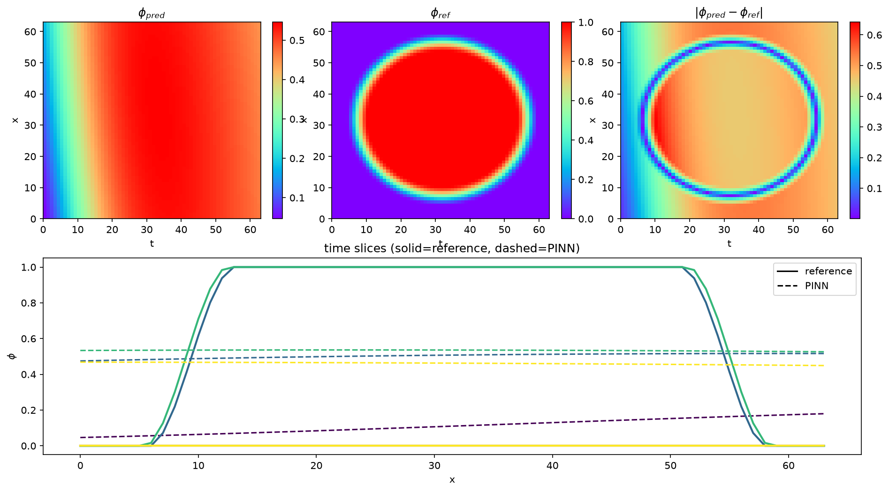
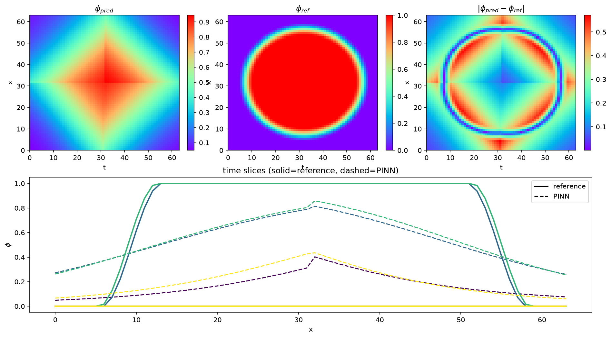

# B2 - Single-Network Baseline (Why PINNs-MPF Decomposes the Domain)

> **This is a motivating demonstration, not a validated benchmark.** Its purpose is
> to show *why* PINNs-MPF uses a spatial decomposition and time-marching. B2 is
> deliberately the case that a single network **cannot** solve well; the validated
> driven-force result is **[B3](../B3_driven_force/)**, which solves the same class of
> problem with a four-worker decomposition and a per-window convergence protocol.

## The point

Driven-force grain shrinkage places a circular grain under a bulk driving force
`Δg` that pushes the interface inward faster than curvature alone. It is a stiff
problem: the network must hold a **sharp** diffuse interface while the grain recedes.

A single global network, given one time window of this problem, cannot hold that
interface. The amplitude collapses - the grain smears into a low-contrast blob
instead of a sharp disc. Splitting the same domain into a `2 x 2` grid of four
worker networks (each seeing a small, locally near-flat piece of the interface)
restores the sharp interface on the identical window. This is the core motivation
for the multi-network design used throughout PINNs-MPF (B3, B4, B5).

## Evidence

Same problem, same time window (`Δg = -250`, `dt = 0.002`, `R0 = 25.6` cells,
`η = 7`), changing only the number of networks:

| Configuration | Networks | Peak `φ` (interface amplitude) | MSE vs reference |
|---|---:|---:|---:|
| Finite-difference reference | - | `1.00` (sharp) | - |
| **Single network** (`1 x 1`) | 1 | **`0.55`** (collapsed) | `0.182` |
| **Four workers** (`2 x 2`) | 4 | **`0.95`** (sharp) | `0.086` |


*One global network collapses the driven interface (peak `φ` falls to `0.55`); the
`2 x 2` decomposition restores it (peak `φ = 0.95`) and halves the field error on the
identical window. Values are read directly from the two runs' `metrics.json`.*

### Full diagnostic renders

The raw single-window diagnostics (predicted field, reference field, and their
difference, plus interface line-profiles) are included for completeness:

| Single network | Four workers |
|---|---|
|  |  |

*Note: each render's colour bar is auto-scaled to that run's own peak `φ`, so the
collapsed single-network field still appears "filled". The true amplitudes are the
common-scale values in the table and hero figure above. The four-worker single-window
field also shows a mild diamond seam artifact from the `2 x 2` box boundaries; that is
a separate early-development detail, resolved in the validated **[B3](../B3_driven_force/)**
result by the per-window convergence protocol. B2's message is strictly the
amplitude/sharpness contrast (0.55 vs 0.95), not the four-worker morphology.*

## Files

- `figures/b2_single_vs_four_network.png` - hero comparison (built from the metrics)
- `figures/single_network_diagnostic.png` - single-network single-window diagnostic
- `figures/four_worker_diagnostic.png` - four-worker single-window diagnostic
- `data/single_network_metrics.json` - recorded single-network run metrics
- `data/four_worker_metrics.json` - recorded four-worker run metrics
- `make_figure.py` - regenerates the hero figure from the two metrics files

## Reproduce

```bash
python make_figure.py   # -> figures/b2_single_vs_four_network.png
```

The underlying runs are single-window diagnostics produced by the grain-shrinkage
runner (`benchmarks/b2_grain_shrinkage/run_decomp.py`, options `B3_DIAG_N1` for the
single network and `B3_DIAG` for the four workers).

## Where this leads

- **[B3 - driven-force grain shrinkage](../B3_driven_force/)** - the validated
  four-worker, time-marched result for this driven physics.
- **[B4 - curvature-driven grain shrinkage](../B4_grain_shrinkage/)** - the same
  multi-network machinery on curvature-only motion.
- **[B5 - triple junction](../B5_triple_junction/)** - the multiphase extension
  (four phases, softmax, `2 x 2` decomposition).
