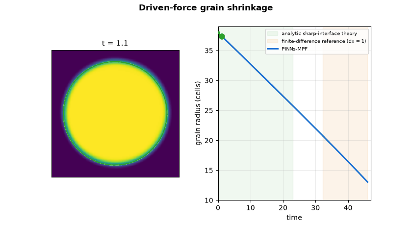
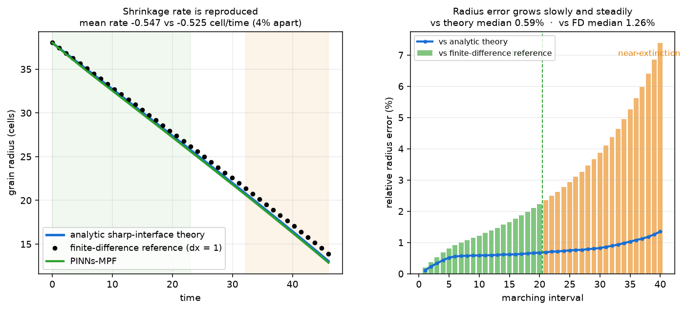
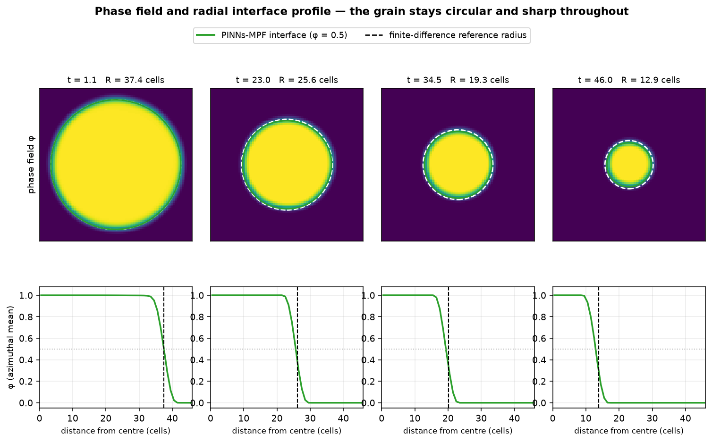

# B3 — Driven-Force Grain Shrinkage

**Paper:** Elfetni & Darvishi Kamachali, *Engineering Analysis with Boundary Elements* 176 (2025) 106200
**Reference solver:** finite-difference phase-field solver (`dx = 1` cell)
**Status:** Validated through the validation target; stable and rate-correct to near extinction, with a documented near-extinction limitation.

---

## Result

> The driven-force grain-shrinkage benchmark is validated through the validation target (interval 20, `t ≈ 23`) and remains stable to near extinction. The full trajectory tracks the finite-difference reference with correct shrinkage rate and clean morphology; a small accumulated over-shrink appears near extinction and is reported as a known limit.

PINNs-MPF marches a shrinking circular grain over 40 time intervals, from radius `R = 38` cells down to `R ≈ 13` cells. Through the validation target the median radius error is `1.26%` (maximum `2.22%`). The predicted shrinkage rate matches the finite-difference reference to within `4%` over the full trajectory, and the phase field stays full-amplitude and circular the whole way. Near extinction the small per-interval over-shrink accumulates and the final absolute radius gap reaches `1.025` cells; this near-extinction over-shrink is the disclosed limitation.



---

## Physics Problem

Single order parameter `φ ∈ [0,1]` under the sinusoidal multi-phase-field formulation, with an added
bulk driving force `Δg`:

```
∂φ/∂t = μ [ σ ( ∇²φ + π²/(2η²)(2φ−1) )  +  (π/η) √(φ(1−φ)) Δg ]
```

Parameters: `μ = σ = 1`, `η = 7` cells, **`Δg = −0.5`**, domain `128 × 128` (`dx = 1`).
Initial condition: a circular grain of radius `R₀ = 38` cells, centred in the domain, with the radial
sinusoidal interface profile.

Unlike the curvature-only case (B4), the driving force adds a constant shrinking term. The
sharp-interface radius law becomes:

```
dR/dt = −μ ( σ/R + |Δg| )
```

so the shrinkage is faster and closer to linear than the curvature-only parabola. The driving term
dominates here (`|Δg| R₀ / σ ≈ 19`), which is why the radius falls almost linearly in time.

---

## Radius Tracking


Three curves are shown, with distinct roles: the **analytic sharp-interface theory**
`dR/dt = −μ(σ/R + |Δg|)` (prominent blue), the **finite-difference reference** (`dx = 1`, black
dashed), and **PINNs-MPF** (green). PINNs-MPF is trained on the physics residual only — it carries no
theory label — so its closeness to the analytic law is not a fit artifact. The lower panel plots the
distance of PINNs-MPF and of the finite-difference reference from that same analytic law: PINNs-MPF
stays within about `0.17` cell of the law across the whole trajectory, while the finite-difference
reference drifts steadily away from it (its own `O(dx²)`, `dx = 1` discretization error), reaching
about `0.85` cell near extinction.

### Radius accuracy against theory and against the finite-difference reference (dual gap)

The over-shrink we report as the headline (vs the finite-difference reference) is the more
conservative of the two comparisons. Over the validated region (intervals 1–20):

| Comparison | Median | Max | Mean gap (cells) |
|---|---:|---:|---:|
| PINNs-MPF vs **analytic theory** | `0.59%` | `0.68%` | `0.166` |
| finite-difference reference vs **analytic theory** | `0.68%` | `1.58%` | `0.217` |
| PINNs-MPF vs **finite-difference reference** (headline) | `1.26%` | `2.22%` | `0.383` |

PINNs-MPF sits *closer* to the analytic sharp-interface law than the `dx = 1` finite-difference
reference does. This is **not** a claim that PINNs-MPF is more accurate than the finite-difference
solver: the sharp-interface law is an idealization that omits the finite interface-width correction,
and both references are kept with distinct roles. It does mean that a substantial part of the reported
"over-shrink vs the finite-difference reference" is the finite-difference reference's own
discretization drift away from the theory. These numbers are regenerated into
[`data/dual_gap.json`](data/dual_gap.json) by `make_figures.py` (no hand-entered values).

## Shrinkage Rate and Error



**Left:** the driven-shrinkage rate is reproduced — the PINNs-MPF radius, the finite-difference reference,
and the sharp-interface law overlay, with mean shrinkage rates of `−0.547` and `−0.525` cell/time
(about `4%` apart). **Right:** the relative radius error grows slowly and steadily; through the validation
target the median is `1.26%` and the maximum `2.22%`. The near-extinction region (orange) is where the
accumulated over-shrink becomes visible in relative terms as the radius gets small.

## Morphology



The predicted grain stays circular and the interface stays sharp throughout. The top row shows the
PINNs-MPF phase field with its `φ = 0.5` interface (green) and the finite-difference reference radius
(dashed white); the two coincide early and separate slightly near extinction. The bottom row shows the
azimuthally-averaged radial profile — the interface keeps its full-amplitude sinusoidal shape with no
erosion or diffusion at any radius.

## Validation Summary


---

## Validated Trajectory

| Region | Intervals | Time | Radius range (cells) | Radius error |
|---|---|---:|---:|---|
| Validated to target | `1 → 20` | `0 → 23` | `38 → 25.6` | median `1.26%`, max `2.22%` |
| Continued tracking | `21 → 28` | `23 → 32` | `25.6 → 20.6` | within acceptance tolerance |
| Near extinction (known limit) | `29 → 40` | `32 → 46` | `20.0 → 12.9` | over-shrink exceeds the absolute tolerance floor, ending at `1.025` cells |

Metric: over-shrink `= R_reference − R_PINNs-MPF` (cells); relative error `= |over-shrink| / R_reference`.
Reference: explicit finite-difference phase-field solver, exact-aligned to machine precision at each
interval boundary.

---

## Extended March to Extinction (demonstration)

A separate **demonstration** follows the same driven grain all the way to `R → 0` over 58 intervals,
to show a complete, convincing closure. It is **not** part of the validated claim above: following the
grain to zero necessarily enters the **sub-η regime** (radius below the `η = 7`-cell interface width),
where the diffuse interface can no longer resolve the grain and the field amplitude fades. That limit
is shown openly rather than hidden, and no accuracy is claimed below `R ≈ η`.


While the grain is resolved (`R > η`) PINNs-MPF continues to sit within about `0.17` cell of the
analytic sharp-interface law, while the finite-difference reference drifts past `1` cell from it; below
`R ≈ η` PINNs-MPF slightly under-shrinks and then fades to zero as the grain becomes unresolvable. Full
figures, the closure animation, and the honest-scope discussion are in
**[`demo_extinction/`](demo_extinction/)**.

---

## Method

**Domain decomposition.** A `3 × 3` grid of nine overlapping MLP workers covers the domain, with
non-uniform box edges `[0, 20, 108, 128]` so the shrinking grain sits inside the central worker. The
phase-sum behaviour is handled per worker; workers are stitched with an overlap-continuity term.

**Network.** Each worker maps `[x, y, t] → φ` through six hidden layers of 64 neurons (`tanh`, with a
bounded output), in `float64` on an NVIDIA A10 GPU (TensorFlow 2.16.2).

**Loss (reference-free after the initial condition).** Each interval minimizes a physics-informed loss:

```
L = w_pde L_pde(interface band)
  + w_ic  L_initial_condition
  + w_dn  L_denoising
  + w_cont L_worker_continuity
```

No finite-difference field, radius law, or reference snapshot is used as a training label inside any
interval. The finite-difference data is used only for evaluation and for the figures.

**Time marching.** 40 uniform intervals of `dt = 1.15` advance the grain from `t = 0` to `t = 46`. The
initial condition of each interval is the PINNs-MPF field at the end of the previous interval. Each
interval repeats an Adam + L-BFGS optimization until its physics loss converges, keeping the
best-converged state for that interval.

---

## Data (`data/`)

| File | Description |
|---|---|
| `driven_force_metrics.json` | Full accepted metrics: 40-interval radii (`R_pinn_cells`, `R_ref_cells`), time boundaries, per-interval diagnostics (`max_phi`, free energy), loss terms |
| `summary.json` | Compact reader summary: parameters, validation-target result, validated-region error, full-trajectory endpoint, shrinkage rate, field quality |
| `dual_gap.json` | Dual radius-gap table over the validated region: PINNs-MPF and the finite-difference reference each vs the analytic sharp-interface law, and vs each other (cells + %). Regenerated by `make_figures.py` |
| `phi_iv0001_R37.36.npy` … `phi_iv0040_R12.87.npy` | The 40 PINNs-MPF phase-field snapshots (`128 × 128`), one per marching interval, used by the figures |

## Figures (`figures/`) and Media (`media/`)

| File | Description |
|---|---|
| `radius_tracking.png` | Radius vs time (analytic theory, finite-difference reference, PINNs-MPF) + dual gap-from-theory panel |
| `shrinkage_accuracy.png` | Driven-shrinkage rate check + relative error vs theory and vs the finite-difference reference |
| `microstructure.png` | Phase field and radial interface profile at four times |
| `validation_summary.png` | Four-panel summary (radius, over-shrink, radial profile, phase fields) |
| `media/driven_force_shrinkage.gif` | Animated grain shrinkage with live radius tracking (46 frames) |
| `demo_extinction/` | Separate **demonstration**: extended march to `R → 0` (58 intervals) with the sub-η limit shown openly — see its [README](demo_extinction/) |

All figures are regenerated on CPU from the packaged snapshots and metrics by `make_figures.py`
(no training, no reference generation):

```bash
CUDA_VISIBLE_DEVICES="" python make_figures.py
```

The full result — not only the figures — is reproducible from the package runner. Its default
option `B3_DRIVEN_FORCE` carries this exact validated configuration (`Δg = −0.5`, `R₀ = 38`,
`128 × 128`, `3 × 3` non-uniform workers with core edges `[0, 20, 108, 128]` and `overlap = 7`,
per-window Adam↔L-BFGS convergence gate to `loss < 2e-6` with best-cycle restore, `K = 40`
windows to `t = 46`). From the package root:

```bash
# inspect the exact resolved config (CPU, no training):
python benchmarks/b3_driven_force/run.py --print-config
# retrain from scratch (GPU recommended; float64 is the default):
python benchmarks/b3_driven_force/run.py --outdir <dir>
```

---

## Limitations

1. **Near-extinction over-shrink (known limit).** A small, steady per-interval over-shrink (about
   `0.02` cell/interval) accumulates over the long march. Because the acceptance tolerance has a fixed
   `0.75`-cell floor, the absolute gap crosses that floor once the grain becomes small (from interval 29),
   ending at `1.025` cells at `t = 46`. This is a documented accuracy limit near extinction, not a loss of
   stability: the field stays full-amplitude and circular, the shrinkage rate stays correct, and there is
   no collapse.
2. **Not exact to extinction.** The trajectory is not presented as exact agreement all the way to
   extinction. The validated claim is the interval-20 target plus stable, rate-correct tracking to near
   extinction.
3. **Finite-difference discretization.** The reference uses `dx = 1` cell, so an `O(dx²)` spatial
   discretization error is present in the reference itself; PINNs-MPF is compared to that reference rather
   than to a sharp-interface idealization.

---

## Suggested Caption

> **Fig. X.** Driven-force grain shrinkage — PINNs-MPF validation on a `128 × 128` domain
> (`η = 7` cells, `μ = σ = 1`, driving force `Δg = −0.5`). PINNs-MPF marches the grain radius over 40 time
> intervals from `R = 38` to `R ≈ 13` cells and tracks the finite-difference phase-field reference with a
> median radius error of `1.26%` through the validation target (`t ≈ 23`). The predicted shrinkage rate
> matches the reference to within `4%` and the interface stays sharp and circular; a small accumulated
> over-shrink near extinction (final gap `1.025` cells) is a disclosed limitation.
