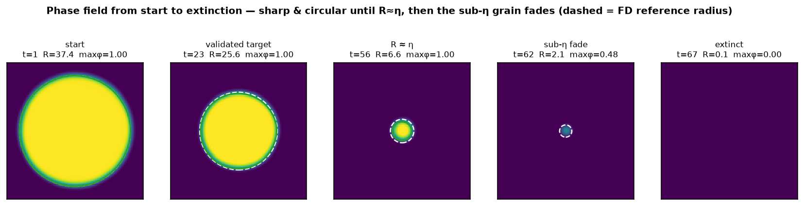

# B3 — Extended March to Extinction (demonstration)

> **This is a demonstration, not an extension of the validated claim.** The validated B3 result
> is unchanged and lives in the [parent folder](../): *validated through the interval-20 target
> (`t ≈ 23`); stable and rate-correct to near extinction; a small accumulated over-shrink near
> extinction is a known limit; no claim of exact agreement to extinction.* This subfolder follows
> the same driven grain all the way to `R → 0` to show a complete, convincing closure — which
> necessarily enters the **sub-η regime**, where the diffuse interface can no longer resolve the
> grain. The figures show that honestly.

---

## What this shows

PINNs-MPF marches the driven grain over **58 intervals**, from `R = 38` cells down to extinction
(`R → 0`, `t = 0 → 65.6`). The trajectory has three parts:

| Region | Intervals | What happens |
|---|---|---|
| Tracked | `1 – ~20` | PINNs-MPF tracks the references; over-shrink `0.582` cell (`2.2%`) vs the finite-difference reference at the interval-20 target |
| Bounded drift | `~20 – ~48` | small, steady over-shrink continues; grain stays sharp and circular (max φ ≈ 1.0), radius `> η` |
| **Sub-η (known limit)** | **~49 – 58** | radius drops below `η = 7` cells; the diffuse interface under-resolves the grain, the field amplitude fades (max φ `0.96 → 0`), and the grain vanishes |




---

## Reading the figure: theory, the FD reference, and PINNs-MPF

Three curves are shown, with distinct roles:

- **Analytic sharp-interface theory** (prominent blue): `dR/dt = −μ(σ/R + |Δg|)`. The idealized
  zero-width-interface law. PINNs-MPF is trained on the **physics residual only** — it carries no
  theory label — so its closeness to this law is not a fit artifact.
- **Finite-difference reference** (black dashed, `dx = 1`): the explicit numerical solver used
  throughout B3. It carries its own `O(dx²)` spatial discretization error.
- **PINNs-MPF** (green).

**Dual gap-from-theory (lower-left panel).** While the grain is resolved (`R > η`), PINNs-MPF stays
within about `0.17` cell of the analytic law across the whole resolved trajectory, whereas the
finite-difference reference drifts steadily away from the same law, exceeding `1` cell near
extinction. In other words, much of what is conservatively reported as PINNs-MPF *over-shrink vs the
FD reference* is the **FD reference's own `dx = 1` discretization drift** away from the
sharp-interface law.

**Honest scope — what this does *not* claim.** The sharp-interface law is itself an idealization
(it omits the finite interface-width correction). Being closer to that law is therefore **not** an
unqualified claim that PINNs-MPF is more accurate than the finite-difference solver. Both references
are kept, with distinct roles, and the gap is reported both ways. In the **sub-η region** no accuracy
is claimed at all: as `R → 0` the *relative* gap necessarily diverges, so that region is judged by the
**absolute** radius gap and by the field amplitude (max φ), not by a percentage. There, PINNs-MPF
slightly *under*-shrinks then fades to zero as the grain becomes unresolvable — the expected
diffuse-interface limit, shown openly rather than hidden.

---

## Provenance / integrity

Rebuilt **CPU-only** from this folder's own packaged snapshots (`data/phi_iv*.npy`, intervals
1–58) and metrics (`data/metrics.json`). No training, no reference generation. The source run
reached full extinction but exited on a **cosmetic** divide-by-zero in its final summary line
(`|ΔR| / R_ref` with `R_ref = 0` at closure); the trajectory data and all 58 snapshots are intact,
and the media is built robustly off the snapshots (per-interval radius parsed from the filename,
amplitude measured as max φ).

Regenerate:

```bash
CUDA_VISIBLE_DEVICES="" python make_extinction_media.py
```

## Files

```
data/metrics.json            run metrics (parameters, radii, time boundaries, per-interval diagnostics)
data/phi_iv0001..0058_*.npy  PINNs-MPF phase-field snapshots (128 x 128), intervals 1..58
figures/radius_to_extinction.png   radius vs time (theory / FD / PINNs-MPF) + η line + sub-η region
                                   + dual gap-from-theory + max-φ amplitude
figures/microstructure_closure.png phase field at start / target / R≈η / sub-η fade / extinct
media/full_closure.gif             animated shrinkage to extinction with live radius + amplitude
make_extinction_media.py           CPU-only regenerator (reads data/ only)
```
