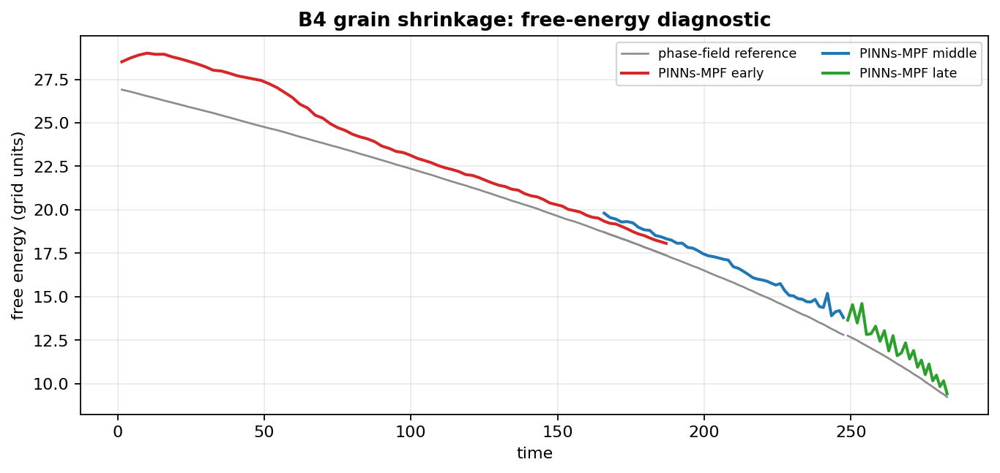

# B4 - Curvature-Driven Grain Shrinkage

**Paper:** Elfetni & Darvishi Kamachali, *Engineering Analysis with Boundary Elements* 176 (2025) 106200  
**Date:** 2026-06-30  
**Status:** Validated

---

## Physics Problem

Allen-Cahn/MPF equation for a single-phase order parameter φ ∈ [0,1], using the
**sinusoidal MPF formulation** implemented in `reference/pf_solver.py`:

```
∂φ/∂t = μ [ σ(∇²φ + π²/(2η²)(2φ−1)) + (π/η)√(φ(1−φ)) Δg ]
```

Parameters: μ=σ=1, η=7 cells, Δg=0, domain 64×64 (dx=1).  
Initial condition: circular grain of radius R₀=25 cells, centered at (32,32), with the radial
sinusoidal MPF interface profile.

Sharp-interface analytic law: **R²(t) = R₀² − 2μσt**  →  R(t) = √(625−2t)  
Extinction at t*=312.5. The three validated intervals cover R=25→8.49 (66% of extinction).

---

## Validated Trajectory

| Validated interval | Purpose | t (absolute) | R range (cells) | Mean relerr | Max relerr |
|---|---|---:|---:|---:|---:|
| Early shrinkage | baseline MultiNN tracking while the grain remains well resolved | `0 -> 188` | `25 -> 16.4` | **0.40%** | 1.51% |
| Middle shrinkage | centered decomposition keeps the grain away from worker seams | `163 -> 248` | `17.4 -> 12.0` | **0.67%** | 1.29% |
| Late shrinkage | small-radius extension after a single FD handoff | `248 -> 283` | `11.95 -> 8.49` | **1.29%** | 2.59% |

Metric: `relerr = |R_PINNs-MPF − R_FD| / R_FD × 100%`  
Reference: explicit-Euler FD phase-field solver (`reference/pf_solver.py`, dt=0.05 from `stable_dt` with safety=0.2).

The early and middle intervals overlap in time (`t ~= 163 -> 188`), which provides an independent cross-check from two decomposition layouts.

---

## PINNs-MPF Architecture

**MultiNN domain decomposition:**
- The early interval uses a 2x2 grid of overlapping MLP workers; the middle and late intervals use a 3x3 grid (9 workers total)
- The middle and late intervals use non-uniform box edges [0, 12, 52, 64] — central worker [12,52]^2 holds the grain entirely for R<=20
- Each MLP: [x, y, τ] → 6 layers × 128 neurons (tanh/tanh/tanh/tanh/tanh/sigmoid) → φ ∈ (0,1)
- 83,201 params per worker -> **332,804 total** for the early interval and **748,809 total** for the middle and late intervals
- Hardware: NVIDIA A10-8Q 8GB, float64, TF 2.16.2

**Training per interval:**
- 120 Adam steps + L-BFGS-B (TFP, 30 history pairs, 180 iterations)
- Losses: PDE residual (band near interface, n_f=3000) + IC (w_ic) + denoising (w_dn=6, margin=1η) + continuity across seams (w_cont=10)
- FD-label-free after each declared IC/handoff: no FD labels, no radius law, no FD snapshots inside the interval training loss

**Time marching (Moving IC):**
- All three production intervals use **radius-spaced adaptive dt**: `R_k = linspace(R₀, R_final, K+1)` and `bnd_k = (R₀²−R_k²)/(2μσ)`, so the time steps are non-uniform.
- The early and middle runs use K=120 with R=25->11, giving t=0->252 and dt≈1.29-2.91; the late run uses K=25 with R=11.95->8.5, giving t_rel=0->35.28 and dt≈1.18-1.64.
- IC for interval k = PINNs-MPF field evaluated at end of interval k-1

---

## Radius Tracking


Only the accepted validation intervals are shown in the summary. Excluded portions correspond to decomposition layouts that were intentionally not used for that radius range.

## Shrinkage Law and Error Distribution


Two complementary views of the same result. **Left:** in `R^2` the curvature-driven shrinkage is a straight line `R^2 = R0^2 - 2 mu sigma t`; both the finite-difference reference and PINNs-MPF collapse onto it, with the small upward departure of the late interval reflecting the diffuse-interface limit at `R/eta ~ 1.2`. **Right:** the distribution of the relative radius error over all 158 accepted time steps is tightly concentrated — median `0.48%`, with 95% of steps below `1.74%`.

The figure is regenerated from the packaged interval metrics by `make_accuracy_analysis.py` (CPU only, no training).

## Reproduction Notes

The accepted trajectory is reconstructed from the data files in `data/`. The late interval starts from the stored finite-difference field at `t=248` and then advances with PINNs-MPF time marching.

---

## Data Directory (`data/`)

| File | Description |
|------|-------------|
| `b4n_cap_ramp_metrics.json` | Early-interval metrics: K=120, R_pinn_cells, R_ref_cells, diag_per_interval, loss_terms |
| `b4n_geom_center_metrics.json` | Middle-interval metrics: K=117 |
| `b4n_geom_extend_metrics.json` | Late-interval metrics: K=25, adaptive dt |
| `b4n_geom_center_warm_meta.json` | Warm checkpoint metadata: interval=82, R=15.963 cells |
| `b4n_geom_center_weights_warm.npy` | Valid warm weights (748,809 params, iv82 spatial state) |
| `phi_iv117_fd.npy` | FD phi field at t=248.089, R_measured=11.948 cells — late-interval IC |

**Not included:** an earlier middle-interval weight file that was later superseded. Warm-start from the middle interval using `b4n_geom_center_weights_warm.npy` instead.

---

## Figures (`figures/`)




| File | Description |
|------|-------------|
| `b4_radius_summary.png` | Radius tracking summary with accepted intervals only |
| `b4_accuracy_analysis.png` | Parabolic shrinkage law `R^2(t)` and relative-error histogram over the accepted steps (from `make_accuracy_analysis.py`) |
| `b4n_radius_error.png` | Detailed radius and relative-error figure for the accepted early, middle, and late intervals |
| `b4n_microstructure.png` | PINNs-MPF-vs-FD phi field comparison: 3 rows (FD / PINNs-MPF / \|error\|) x 4 columns |
| `b4n_energy.png` | Free-energy diagnostic from `diag_per_interval[i][pinn][free_energy]` - overall decreasing trend with small PINNs-MPF roughness oscillations |

---

## Media (`media/`)

| File | Description |
|------|-------------|
| `b4n_shrinkage.gif` | Animated grain shrinkage: FD φ field (color) + FD contour (white) + PINNs-MPF radius circle (dashed green) + radius tracking panel. 113 frames, ~90 ms/frame |

## Caveats and Limitations

1. **Superseded middle-interval weight file:** an earlier middle-interval `weights.npy` was superseded and is not shipped. Warm-start from the middle interval using the packaged warm-start file instead.

2. **Late-interval FD IC handoff:** The late interval begins from a single FD-generated phi field (not a PINNs-MPF field). All 25 subsequent ICs are PINNs-MPF-propagated.

3. **R/eta limit:** At R=8.49 cells, R/eta=1.21 — the grain is resolved but approaching the diffuse-interface limit where the curvature law R²=R₀²−2μσt begins to fail. The growing error trend (1.1% early -> 1.7% late in the final interval) is expected and physically motivated.

4. **FD discretization error:** The FD reference uses dx=1 cell, so O(dx²) = O(1) grid unit spatial error is present. Comparing PINNs-MPF to FD rather than the analytic law accounts for this (both have the same discretization).

5. **Interval overlap:** Two accepted runs cover t≈163-188 independently. The validated sub-zones come from different spatial decompositions (2x2 vs 3x3).

6. **Denoising loss:** `dn_margin_eta=1.0` prevents the denoising pins from acting within 1η of the interface front. This avoids artificial inward pull on the interface but means the 7-cell-wide bulk adjacent to the interface is unconstrained by denoising.

---


