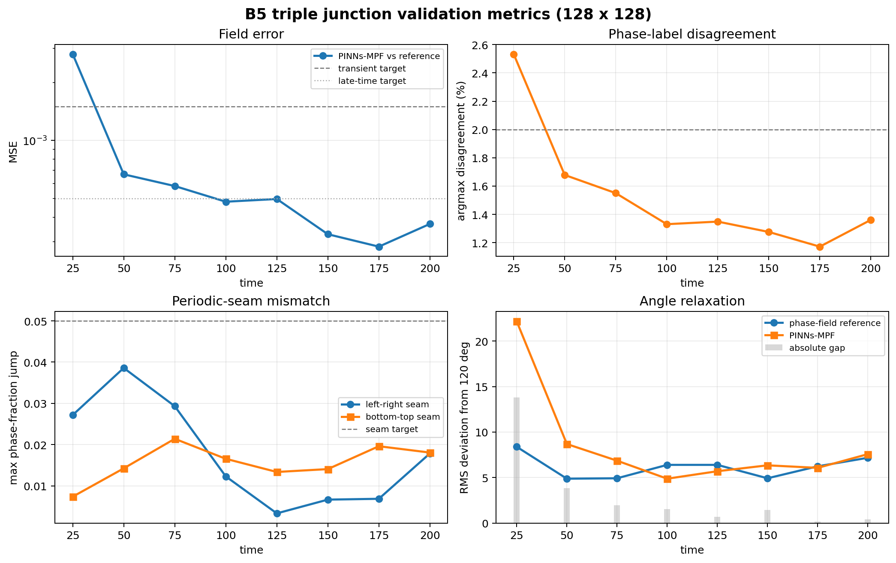

# B5 Triple Junction

Status: validated through `t=200` (`2.28 tau_c`) on a `128 x 128` grid, with the first rapid transient disclosed.

This benchmark tests a four-phase triple-junction relaxation problem. The reference is a finite-difference multiphase-field simulation. PINNs-MPF uses a time-marched MultiNN formulation with four spatial workers, four softmax phase outputs per worker, and reference-field handoff at the start of each window.

## Main Result


The initial condition contains six visible junctions and local 90/90/180 geometry. The finite-difference reference relaxes quickly toward the Young-angle network. PINNs-MPF preserves the junction topology throughout the trajectory and tracks the reference field after the first rapid transient.

The row layout is:

- phase-field reference;
- PINNs-MPF prediction;
- maximum absolute phase-fraction difference.

The first window (`t=0 -> 25`) is visibly harder than the later windows: the reference rounds the junctions rapidly, while PINNs-MPF still carries part of the initial rectangular geometry. From `t=50` onward, the phase maps are visually close, and the discrepancy is restricted to the diffuse-interface bands.

The reference physics is a continuous relaxation from the 90-degree initial condition toward the 120-degree Young-angle network — the microstructure morphs while the junction angles converge to 120 degrees and the interfacial energy dissipates:


## Metrics

| Window end | MSE vs reference | Argmax disagreement | Angle gap | Junctions |
|---:|---:|---:|---:|---:|
| `t=25` | `2.80e-3` | `2.53%` | `13.8 deg` | `6` |
| `t=50` | `6.68e-4` | `1.68%` | `3.0 deg` | `6` |
| `t=75` | `5.81e-4` | `1.55%` | `1.9 deg` | `6` |
| `t=100` | `4.82e-4` | `1.33%` | `<2 deg` | `6` |
| `t=125` | `4.98e-4` | `1.35%` | `<1 deg` | `6` |
| `t=150` | `3.27e-4` | `1.28%` | `1.4 deg` | `6` |
| `t=175` | `2.82e-4` | `1.17%` | `<0.2 deg` | `6` |
| `t=200` | `3.70e-4` | `1.36%` | `0.40 deg` | `6` |



The phase-sum constraint stays at machine precision in every window. The maximum bottom-top seam mismatch remains below `0.022`, and the final left-right seam mismatch is below `0.018`.

## Relaxation Physics

This is the reference physics that PINNs-MPF is validated against (the per-window PINNs-MPF-vs-reference accuracy is in the metrics figure above).


**Left:** the three distinct junction angles relax from the `90/90/180` initial condition toward the `120` degree Young equilibrium. **Right:** the interfacial free energy decreases monotonically to `0.46` of its initial value, as expected for a curvature-driven gradient flow. Regenerated from the packaged reference trajectory by `make_relaxation_physics.py` (CPU only, no training).

## 64 x 64 Reference Comparison

The earlier `64 x 64` validation is retained as a compact comparison, not as the main benchmark result:


That case belongs to the same benchmark family and uses the same phase-field reference vs PINNs-MPF time-window protocol, but it uses a different, near-equilibrium initial condition. It is therefore a smaller-grid comparison, not a pure grid-refinement control of the `128 x 128` 90-degree relaxation.

## Configuration

- Grid: `128 x 128`
- Physical parameters: `eta=6/64`, `mu=1e-4`, `sigma=1`
- Characteristic time: `tau_c=87.890625`
- Time horizon: `t=0 -> 200`
- Windows: eight windows of `dt=25`
- Architecture: four spatial workers on a `2 x 2` decomposition
- Worker network: `(64,) x 6`, four softmax phase outputs
- Collocation: `n_f=4800`
- Optimizer: Adam, 800 steps per window
- Handoff: each window starts from the phase-field reference at that time

## Loss Definition

```text
L = w_pde L_pde
  + w_ic L_ic
  + w_dn L_denoising
  + w_cont L_internal_continuity
  + w_pbc L_periodic_seam
```

The phase-field endpoint is not used as a supervised target in the loss. It is used only for metrics and visual comparison. The phase-sum constraint is enforced by softmax.

## What The Claim Means

Use this wording when citing the result:

> The 128 x 128 triple-junction benchmark validates PINNs-MPF topology and field tracking for a periodic-safe 90 degree to near-120 degree relaxation through t=200 (2.28 tau_c). Window 1 remains a disclosed fast-transient limitation; windows 2-8 satisfy the required field, topology, seam, and angle-tracking criteria under reference-field handoff.

This is not a fully autonomous rollout from only the global `t=0` field. It is a time-window validation: each window is physics-informed and unsupervised inside the window, while the initial condition of each new window is supplied by the finite-difference reference.

## Files

- `figures/b5_triple_junction_reference_vs_pinns_mpf_128.png` - phase-field reference, PINNs-MPF prediction, and absolute difference
- `figures/b5_triple_junction_metrics_128.png` - field, seam, and angle metrics
- `figures/b5_triple_junction_relaxation_physics_128.png` - reference junction-angle relaxation and free-energy dissipation (from `make_relaxation_physics.py`)
- `figures/b5_triple_junction_junction_markers_128.png` - junction-marker check
- `figures/b5_triple_junction_reference_snapshots_128.png` - phase-field reference snapshots
- `media/triple_junction_relaxation_128.gif` - smooth continuous relaxation of the phase-field reference with junction-angle and interfacial-energy readouts (from `make_triple_junction_evolution.py`)
- `make_triple_junction_evolution.py` - regenerator for the relaxation animation
- `media/triple_junction_reference_vs_pinns_mpf_128_slow.gif` - earlier 6-snapshot reference/PINNs-MPF/difference comparison (superseded by the smooth relaxation animation)
- `reference/b5_ref_90_to_120_128.npz` - finite-difference reference trajectory
- `reference/b5_meta_90_to_120_128.json` - reference metadata
- `run/summary_90_to_120_128_t200.json` - combined run summary
- `run/window_*/metrics.json` - per-window metrics
- `reports/validation_summary_128x128.md` - detailed validation summary
- `comparison_64x64/` - smaller-grid reference comparison

Earlier exploratory records are kept separately from the public package.
